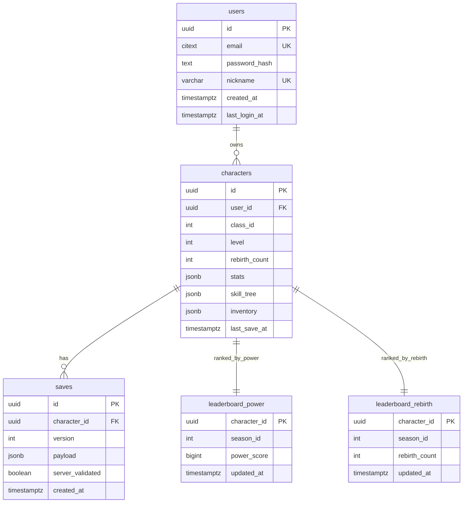

# DB 스키마

## ERD

## 테이블

| 테이블 | 주요 컬럼 | 제약 / 인덱스 |
| --- | --- | --- |
| `users` | `id`, `email`, `password_hash`, `nickname`, `created_at`, `last_login_at` | `email` citext unique, `nickname` unique |
| `characters` | `id`, `user_id`, `class_id`, `level`, `rebirth_count`, `stats`, `skill_tree`, `inventory`, `last_save_at` | `user_id` cascade FK, `class_id between 1 and 5`, `level between 1 and 200` |
| `saves` | `id`, `character_id`, `version`, `payload`, `server_validated`, `created_at` | `character_id` cascade FK, `saves_character_created(character_id, created_at desc)` |
| `leaderboard_power` | `character_id`, `season_id`, `power_score`, `updated_at` | `leaderboard_power_season_score(season_id, power_score desc)` |
| `leaderboard_rebirth` | `character_id`, `season_id`, `rebirth_count`, `updated_at` | `leaderboard_rebirth_season_count(season_id, rebirth_count desc)` |

마이그레이션 파일은 `server/migrations/0001_init.sql`, 롤백은 `server/migrations/0001_init.down.sql`이다.
