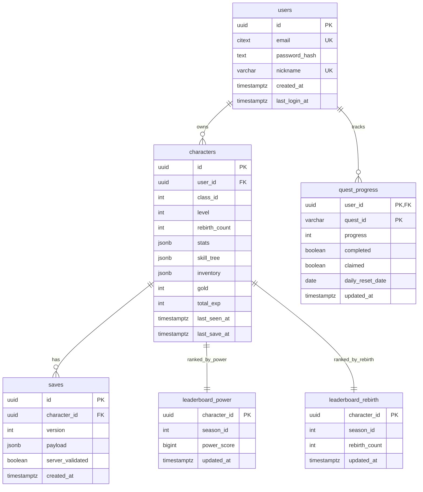

# DB 스키마

## ERD

## 테이블

| 테이블 | 주요 컬럼 | 제약 / 인덱스 |
| --- | --- | --- |
| `users` | `id`, `email`, `password_hash`, `nickname`, `created_at`, `last_login_at` | `email` citext unique, `nickname` unique |
| `characters` | `id`, `user_id`, `class_id`, `level`, `rebirth_count`, `stats`, `skill_tree`, `inventory`, `gold`, `total_exp`, `last_seen_at`, `last_save_at` | `user_id` cascade FK, `class_id between 1 and 5`, `level between 1 and 200`, `gold >= 0`, `total_exp >= 0` |
| `saves` | `id`, `character_id`, `version`, `payload`, `server_validated`, `created_at` | `character_id` cascade FK, `saves_character_created(character_id, created_at desc)` |
| `leaderboard_power` | `character_id`, `season_id`, `power_score`, `updated_at` | `leaderboard_power_season_score(season_id, power_score desc)` |
| `leaderboard_rebirth` | `character_id`, `season_id`, `rebirth_count`, `updated_at` | `leaderboard_rebirth_season_count(season_id, rebirth_count desc)` |
| `quest_progress` | `user_id`, `quest_id`, `progress`, `completed`, `claimed`, `daily_reset_date`, `updated_at` | PK(`user_id`, `quest_id`), `user_id` cascade FK, `quest_progress_user_completed_idx`, `quest_progress_daily_reset_idx` |

마이그레이션 파일은 `server/migrations/0001_init.sql`, 롤백은 `server/migrations/0001_init.down.sql`이다.

## SkillDB Mirror
PR #15 keeps combat execution authoritative in the Unreal client, but the server now has a read-only warrior SkillDB mirror at `server/src/core/data/skills.ts` for stable cross-reference.

| Field | Meaning |
| --- | --- |
| `skillId` | Stable client/server skill identifier |
| `classId` | Class owner; warrior is `1` |
| `displayName` | Localized display name |
| `type` | `active`, `passive`, or `ultimate` |
| `effectType` | `damage_single`, `damage_aoe`, `self_buff`, or `dash_damage` |
| `cooldown` | Cooldown seconds |
| `damageCoeff` | ATK multiplier |
| `buffMagnitude` | Buff amount as ratio |
| `buffDuration` | Buff duration seconds |
| `gaugeGainOnHit` | Ultimate gauge gained on normal hit |
| `gaugeGainOnTakeDamage` | Ultimate gauge gained on taking damage |
