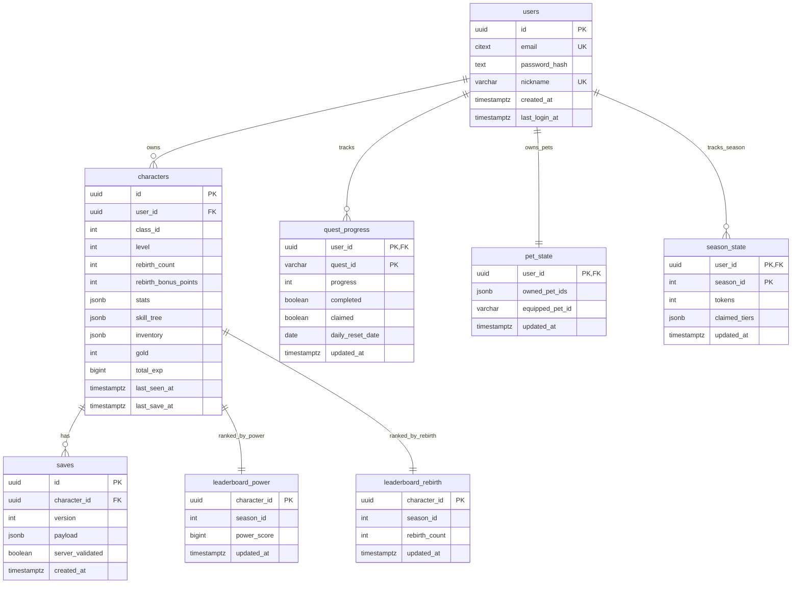

<!-- markdownlint-disable MD013 -->

# DB 스키마

## ERD

## 테이블

| 테이블 | 주요 컬럼 | 제약 / 인덱스 |
| --- | --- | --- |
| `users` | `id`, `email`, `password_hash`, `nickname`, `created_at`, `last_login_at` | `email` citext unique, `nickname` unique |
| `characters` | `id`, `user_id`, `class_id`, `level`, `rebirth_count`, `rebirth_bonus_points`, `stats`, `skill_tree`, `inventory`, `gold`, `total_exp`, `last_seen_at`, `last_save_at` | `user_id` cascade FK, `class_id between 1 and 5`, `level between 1 and 1000`, `rebirth_bonus_points >= 0`, `gold >= 0`, `total_exp bigint >= 0` |
| `saves` | `id`, `character_id`, `version`, `payload`, `server_validated`, `created_at` | `character_id` cascade FK, `saves_character_created(character_id, created_at desc)` |
| `leaderboard_power` | `character_id`, `season_id`, `power_score`, `updated_at` | `leaderboard_power_season_score(season_id, power_score desc)` |
| `leaderboard_rebirth` | `character_id`, `season_id`, `rebirth_count`, `updated_at` | `leaderboard_rebirth_season_count(season_id, rebirth_count desc)` |
| `quest_progress` | `user_id`, `quest_id`, `progress`, `completed`, `claimed`, `daily_reset_date`, `updated_at` | PK(`user_id`, `quest_id`), `user_id` cascade FK, `quest_progress_user_completed_idx`, `quest_progress_daily_reset_idx` |
| `pet_state` | `user_id`, `owned_pet_ids`, `equipped_pet_id`, `updated_at` | PK(`user_id`), `user_id` cascade FK |
| `season_state` | `user_id`, `season_id`, `tokens`, `claimed_tiers`, `updated_at` | PK(`user_id`, `season_id`), `user_id` cascade FK, `season_state_tokens_idx` |

마이그레이션 파일은 `server/migrations/0001_init.sql`부터 적용한다.
PR #54는 `server/migrations/0006_character_total_exp_bigint.sql`에서
level 1000 누적 경험치 저장을 위해 `characters.total_exp`를 bigint로 승격한다.

## SkillDB Mirror

PR #15 keeps combat execution authoritative in the Unreal client, but the server now has a read-only SkillDB mirror at `server/src/core/data/skills.ts` for stable cross-reference. PR #30 extends the mirror with status and element fields.

| Field | Meaning |
| --- | --- |
| `skillId` | Stable client/server skill identifier |
| `classId` | Class owner; warrior is `1`, mage `2`, archer `3`, thief `4`, cleric `5`, paladin `6`, berserker `7`, summoner `8` |
| `displayName` | Localized display name |
| `type` | `active`, `passive`, or `ultimate` |
| `effectType` | `damage_single`, `damage_aoe`, `self_buff`, `dash_damage`, or `heal` |
| `cooldown` | Cooldown seconds |
| `damageCoeff` | ATK multiplier |
| `buffMagnitude` | Buff amount as ratio |
| `buffDuration` | Buff duration seconds |
| `gaugeGainOnHit` | Ultimate gauge gained on normal hit |
| `gaugeGainOnTakeDamage` | Ultimate gauge gained on taking damage |
| `statusEffect` | `none`, `poison`, `burn`, or `freeze` |
| `statusDuration` | Status duration seconds |
| `statusMagnitude` | DoT tick damage or freeze slow ratio |
| `element` | `none`, `fire`, `ice`, `lightning`, or `holy` |

## PetDB Mirror

PR #22 adds `server/src/core/data/pets.ts` as the server-authoritative V1 pet mirror.

| Pet | Bonus |
| --- | --- |
| `dog` | `gold +20%` |
| `bird` | `drop +15%` |

## Season Pass Mirror

PR #22 adds `server/src/core/data/season.ts` with 10 free-track tiers. Progress is stored in `season_state.tokens`; claimed rewards are tracked in `season_state.claimed_tiers`.
